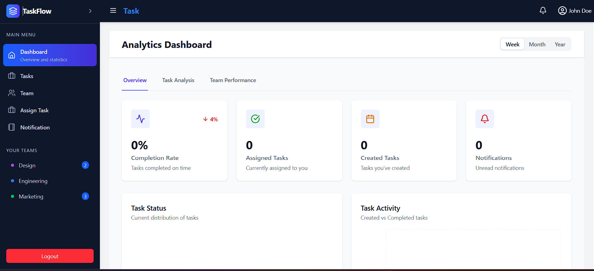
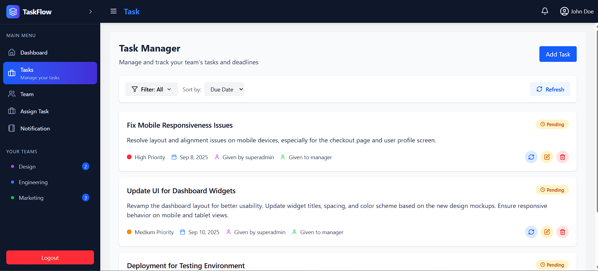
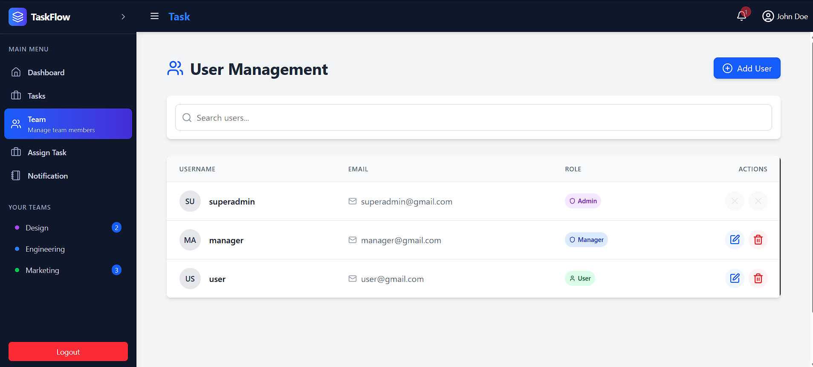
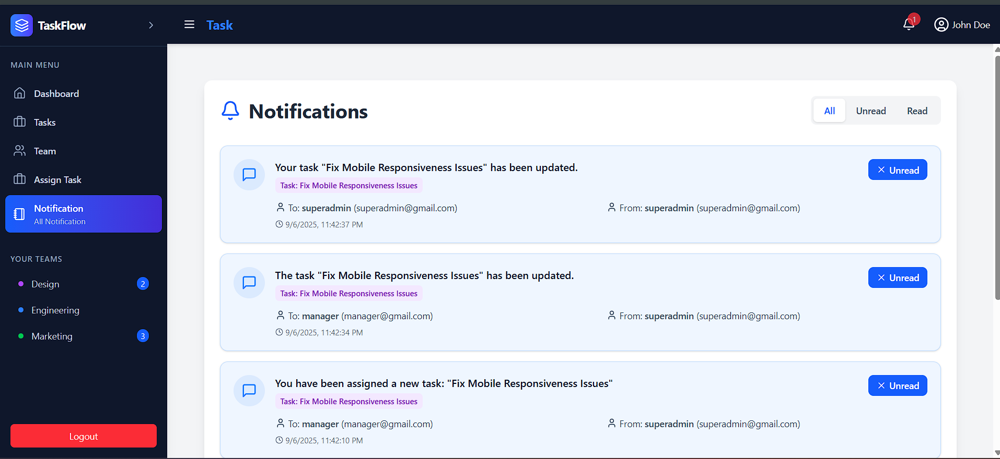
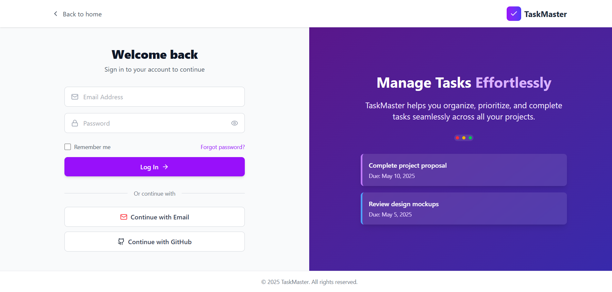
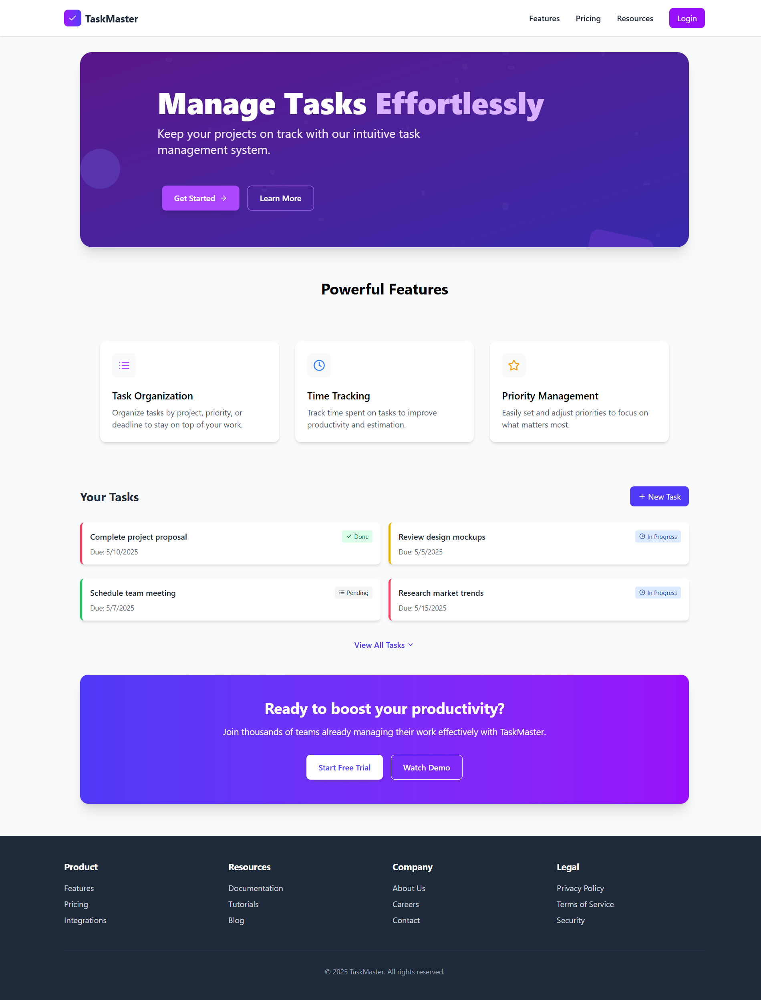

# Task Management Application

A full-stack task management application built with Node.js, Express, MongoDB, and React. This application provides a comprehensive solution for managing tasks with role-based access control, real-time notifications, and detailed analytics.

## 🚀 Live Demo

Access the live application: [Your Live Application Link](https://task-masterfront.vercel.app/)

## 📸 Screenshots

| Dashboard | Task Manager |
|-----------|-------------|
|  |  |

| User Management | Notifications |
|----------------|---------------|
|  |  |

| Login Page | Landing Page |
|------------|-------------|
|  |  |

## 🔐 Test Credentials

Use the following credentials to explore different user roles:

### Admin
- **Email:** `superadmin@gmail.com`
- **Password:** `superadmin@gmail.com`

### Manager
- **Email:** `manager@gmail.com`
- **Password:** `manager@gmail.com`

### User
- **Email:** `user@gmail.com`
- **Password:** `user@gmail.com`

## 🏗️ Project Structure

```
task-management-app/
├── backend/
│   ├── config/
│   │   └── db.js                     # Database configuration
│   ├── controllers/
│   │   ├── authController.js         # Authentication controller
│   │   ├── getDashboardAnalytics.js  # Dashboard analytics controller
│   │   ├── notificationController.js # Notification controller
│   │   └── taskController.js         # Task management controller
│   ├── middlewares/
│   │   └── authMiddleware.js         # Authentication middleware
│   ├── models/
│   │   ├── Notification.js           # Notification model
│   │   ├── Task.js                   # Task model
│   │   └── User.js                   # User model
│   ├── routes/
│   │   ├── authRoutes.js             # Authentication routes
│   │   ├── dashboardRoutes.js        # Dashboard routes
│   │   ├── notificationRoutes.js     # Notification routes
│   │   └── taskRoutes.js             # Task routes
│   ├── utils/
│   │   ├── email.js                  # Email utility functions
│   │   └── generateToken.js          # JWT token generation
│   └── server.js                     # Express application entry point
├── frontend/
│   ├── public/                       # Static assets
│   ├── src/
│   │   ├── assets/                   # Frontend assets
│   │   │   └── react.svg             # React logo
│   │   ├── Comp/                     # React components
│   │   │   ├── AddTask.jsx           # Add task component
│   │   │   ├── Dashboard.jsx         # Dashboard component
│   │   │   ├── EditTask.jsx          # Edit task component
│   │   │   ├── Navbar.jsx            # Navigation bar component
│   │   │   ├── NotificationPage.jsx  # Notification page component
│   │   │   ├── Sidebar.jsx           # Sidebar component
│   │   │   ├── Task.jsx              # Task component
│   │   │   ├── Unauthorized.jsx      # Unauthorized access component
│   │   │   └── User.jsx              # User component
│   │   ├── Context/                  # React context for state management
│   │   ├── pages/                    # Page components
│   │   │   ├── App.jsx               # Root App component
│   │   │   ├── Home.jsx              # Home page
│   │   │   ├── Layout.jsx            # Layout component
│   │   │   └── Login.jsx             # Login page
│   │   ├── App.css                   # Global styles
│   │   ├── index.css                 # CSS reset and base styles
│   │   └── main.jsx                  # Frontend entry point
│   ├── .gitignore                    # Git ignore file
│   ├── eslint.config.js              # ESLint configuration
│   ├── index.html                    # HTML template
│   ├── package.json                  # Frontend dependencies
│   └── vite.config.js                # Vite configuration
├── .gitignore                        # Git ignore file
├── package.json                      # Project dependencies
├── package-lock.json                 # Package lock file
├── version.json                      # Version information
└── README.md                         # Project documentation
```

## 🛠️ Tech Stack

### Backend
- **Node.js** - Runtime environment
- **Express.js** - Web framework
- **MongoDB** - Database
- **Mongoose** - ODM for MongoDB
- **JWT** - Authentication
- **bcrypt** - Password hashing
- **Nodemailer** - Email service

### Frontend
- **React** - Frontend library
- **Vite** - Build tool
- **React Router** - Routing
- **Context API** - State management
- **CSS3** - Styling

## 📋 Prerequisites

Before you begin, ensure you have the following installed:

- **Node.js** (v16 or higher) - [Download Node.js](https://nodejs.org/)
- **MongoDB** - [Local installation](https://docs.mongodb.com/manual/installation/) or [MongoDB Atlas](https://www.mongodb.com/cloud/atlas)
- **npm** or **yarn** - Package manager (comes with Node.js)
- **Git** - Version control system

## 🚀 Installation and Setup

### 1. Clone the Repository

```bash
git clone https://github.com/Rahulsaini27/task-management-app.git
cd task-management-app
```

### 2. Install Dependencies

Install dependencies for the entire project:

```bash
npm install
```

Or install frontend dependencies separately:

```bash
cd frontend
npm install
cd ..
```

### 3. Environment Configuration

Create a `.env` file in the root directory:

```env
# Server Configuration
PORT=5000
NODE_ENV=development

# MongoDB Configuration
MONGODB_URI=mongodb://localhost:27017/task-management
# For MongoDB Atlas, use:
# MONGODB_URI=mongodb+srv://<username>:<password>@cluster.mongodb.net/task-management

# JWT Configuration
JWT_SECRET=your_super_secret_jwt_key_here
JWT_EXPIRE=30d

# Email Configuration (Optional - for email notifications)
EMAIL_SERVICE=gmail
EMAIL_USERNAME=your-email@gmail.com
EMAIL_PASSWORD=your-app-password
EMAIL_FROM=noreply@taskmanagement.com

# Frontend URL (for CORS)
CLIENT_URL=http://localhost:5173
```

### 4. Database Setup

**Option A: Local MongoDB**
1. Install MongoDB locally
2. Start MongoDB service:
   ```bash
   # Windows
   net start MongoDB
   
   # macOS (with Homebrew)
   brew services start mongodb-community
   
   # Linux
   sudo systemctl start mongod
   ```

**Option B: MongoDB Atlas**
1. Create a free account at [MongoDB Atlas](https://www.mongodb.com/cloud/atlas)
2. Create a new cluster
3. Get your connection string and update the `MONGODB_URI` in `.env`

### 5. Run the Application

**Development Mode (Recommended)**

Run both frontend and backend concurrently:

```bash
npm run dev
```

**Individual Services**

Backend only:
```bash
npm run server
```

Frontend only:
```bash
npm run client
```

The application will be available at:
- **Frontend:** http://localhost:5173
- **Backend:** http://localhost:5000

## 🔌 API Endpoints

### Authentication Routes
```http
POST   /api/auth/register     # Register new user
POST   /api/auth/login        # User login
GET    /api/auth/logout       # User logout
GET    /api/auth/me           # Get current user profile
```

### Task Routes
```http
GET    /api/tasks             # Get all tasks for current user
POST   /api/tasks             # Create a new task
GET    /api/tasks/:id         # Get specific task
PUT    /api/tasks/:id         # Update task
DELETE /api/tasks/:id         # Delete task
```

### Dashboard Routes
```http
GET    /api/dashboard/analytics   # Get dashboard analytics
```

### Notification Routes
```http
GET    /api/notifications         # Get all notifications
PUT    /api/notifications/:id     # Mark notification as read
DELETE /api/notifications/:id     # Delete notification
```

## 🔒 Authentication Flow

1. User registers with email and password
2. Backend validates input, hashes password using bcrypt
3. User record is created in MongoDB
4. JWT token is generated and returned to client
5. Client stores token for subsequent authenticated requests
6. Protected routes verify token using authentication middleware

## ✨ Features

### Core Features
- ✅ **User Authentication & Authorization** - Secure login/register system
- ✅ **Role-based Access Control** - Admin, Manager, and User roles
- ✅ **Task Management** - Create, read, update, delete tasks
- ✅ **Dashboard Analytics** - Visual representation of task statistics
- ✅ **Real-time Notifications** - Stay updated with task changes
- ✅ **Responsive Design** - Works seamlessly on desktop and mobile

### User Roles & Permissions
- **Admin:** Full access to all features, user management
- **Manager:** Task management, team oversight, limited user management
- **User:** Personal task management, basic features

## 🚀 Deployment

### Backend Deployment

1. **Prepare for Production**
   ```env
   NODE_ENV=production
   MONGODB_URI=your_production_mongodb_uri
   JWT_SECRET=your_production_jwt_secret
   ```

2. **Deploy to Heroku**
   ```bash
   heroku create your-app-name
   heroku config:set NODE_ENV=production
   heroku config:set MONGODB_URI=your_mongodb_uri
   heroku config:set JWT_SECRET=your_jwt_secret
   git push heroku main
   ```

3. **Alternative Platforms**
   - **Railway:** Connect GitHub repository and deploy
   - **Render:** Similar to Heroku, with automatic deployments
   - **DigitalOcean App Platform:** Container-based deployment

### Frontend Deployment

1. **Build for Production**
   ```bash
   cd frontend
   npm run build
   ```

2. **Deploy to Netlify**
   - Connect your GitHub repository
   - Set build command: `npm run build`
   - Set publish directory: `dist`

3. **Deploy to Vercel**
   ```bash
   npm i -g vercel
   vercel --prod
   ```

## 🐛 Troubleshooting

### Common Issues & Solutions

**MongoDB Connection Error**
```
Error: MongoServerError: bad auth Authentication failed
```
- ✅ Check if MongoDB service is running
- ✅ Verify connection string in `.env`
- ✅ Ensure network access for MongoDB Atlas
- ✅ Check username/password for Atlas

**JWT Authentication Failures**
```
Error: JsonWebTokenError: invalid signature
```
- ✅ Verify `JWT_SECRET` in `.env` file
- ✅ Check token expiration settings
- ✅ Clear browser localStorage/cookies
- ✅ Ensure consistent JWT_SECRET across environments

**Frontend Build Issues**
```
Error: Cannot resolve dependency
```
- ✅ Delete `node_modules` and `package-lock.json`
- ✅ Run `npm install` again
- ✅ Check for package version conflicts
- ✅ Update Node.js to latest LTS version

**CORS Errors**
```
Error: Access to fetch blocked by CORS policy
```
- ✅ Add frontend URL to `CLIENT_URL` in backend `.env`
- ✅ Check CORS configuration in `server.js`
- ✅ Ensure both frontend and backend are running

## 🤝 Contributing

We welcome contributions! Please follow these steps:

1. **Fork the repository**
2. **Create a feature branch**
   ```bash
   git checkout -b feature/amazing-feature
   ```
3. **Commit your changes**
   ```bash
   git commit -m 'Add some amazing feature'
   ```
4. **Push to the branch**
   ```bash
   git push origin feature/amazing-feature
   ```
5. **Open a Pull Request**

### Development Guidelines

**Backend**
- Use controllers for request/response logic
- Implement middleware for cross-cutting concerns
- Follow MVC pattern with models, routes, and controllers
- Use async/await for asynchronous operations
- Add proper error handling and validation

**Frontend**
- Use React functional components with hooks
- Organize code by feature/component
- Use Context API for global state management
- Implement responsive design
- Follow React best practices

## 📝 Scripts

```json
{
  "dev": "concurrently \"npm run server\" \"npm run client\"",
  "server": "nodemon backend/server.js",
  "client": "cd frontend && npm run dev",
  "build": "cd frontend && npm run build",
  "start": "node backend/server.js"
}
```

## 📄 License

This project is licensed under the MIT License - see the [LICENSE](LICENSE) file for details.

## 👨‍💻 Author

**Rahul Saini**
- GitHub: [@Rahulsaini27](https://github.com/Rahulsaini27)
- LinkedIn: [Your LinkedIn Profile](https://www.linkedin.com/in/rahul-saini-3994a2241/)
- Email: rahulsaini42854@gmail.com

## 🙏 Acknowledgments

- React team for the amazing frontend library
- Express.js for the robust backend framework
- MongoDB for the flexible database solution
- All contributors who helped improve this project

## 📞 Support

If you have any questions or need help, please:

1. Check the [Issues](https://github.com/Rahulsaini27/task-management-app/issues) page
2. Create a new issue if your problem isn't listed
3. Contact the author through GitHub

---

⭐ **Don't forget to star this repository if you found it helpful!**